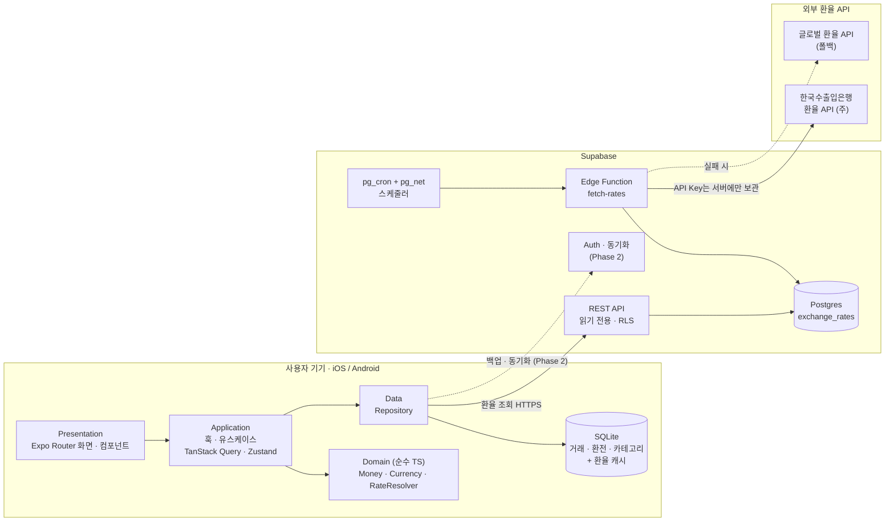
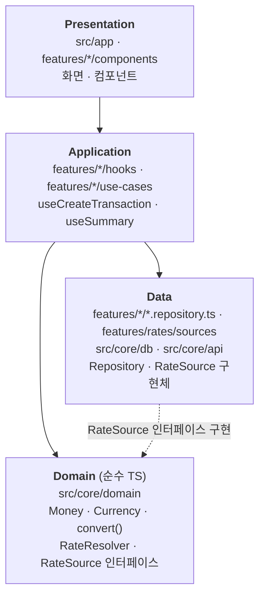
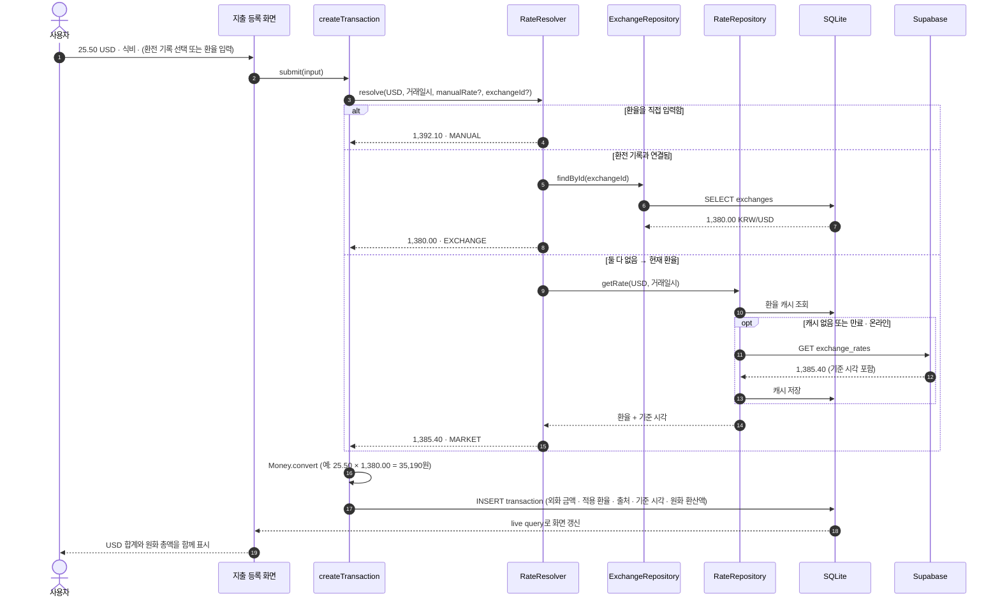
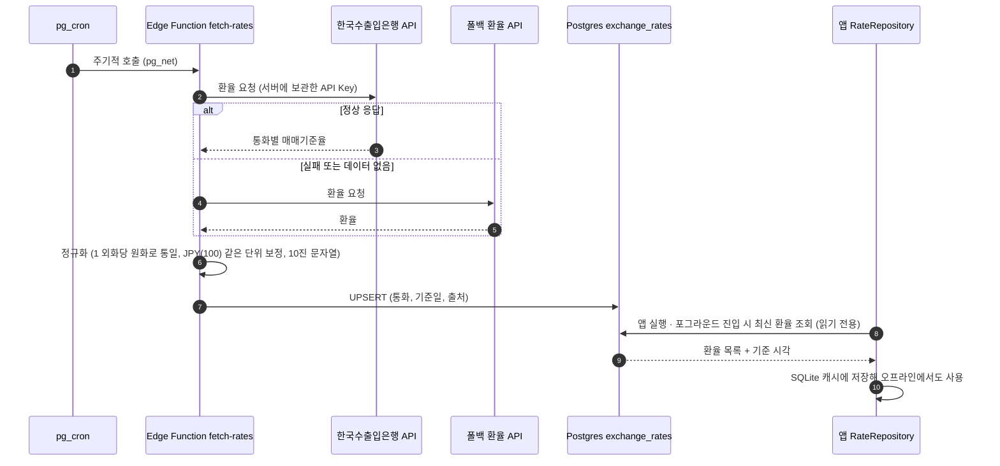
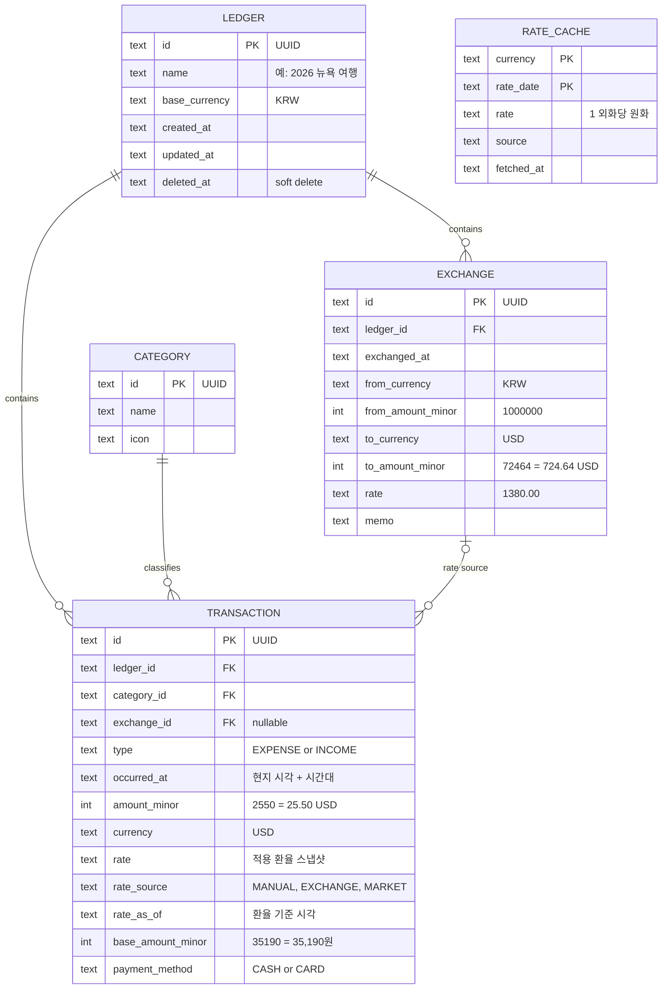

# 01. 기술 스택 · 시스템 아키텍처 · 폴더 구조

> **Tradger** — 외화와 원화를 함께 기록하고 보여주는 모바일(iOS/Android) 가계부

## 0. 요구사항과 설계 원칙

### 핵심 요구사항

| # | 요구사항 |
|---|---|
| R1 | 지출/수입을 **외화(USD, JPY 등)와 원화(KRW)로 함께** 표시한다. |
| R2 | 환전할 때의 **환율을 입력했다면 그 환율**로 원화를 계산한다. |
| R3 | 입력한 환율이 없다면 **현재 환율**로 계산한다. |
| R4 | **통화별 총 사용 금액**과 **원화로 환산한 총 사용 금액**을 둘 다 보여준다. |

### 아키텍처를 결정하는 원칙

1. **로컬 우선(Offline-first)**
   해외에서는 데이터가 자주 끊긴다. 기기 안의 SQLite를 원본 데이터로 쓰고, 네트워크는 환율 갱신(이후에는 백업·동기화)에만 쓴다.
2. **환율 스냅샷 저장**
   거래를 저장할 때 *적용한 환율, 환율 출처, 기준 시각, 원화 환산액*을 함께 저장한다. 시세가 바뀌어도 과거 기록의 원화 금액은 바뀌지 않는다.
3. **부동소수점 금지**
   금액은 **최소 단위 정수**(USD 25.50 → `2550`, KRW 35,190 → `35190`)로, 환율은 **10진 문자열**(`"1380.00"`)로 저장한다. 계산은 decimal 라이브러리로 한다.
4. **환율 API는 서버에서만 호출**
   API 키를 앱에 넣지 않고, 호출 한도를 지키고, 환율 제공처를 앱 업데이트 없이 바꿀 수 있게 하기 위해서다. 앱은 우리 서버에 저장된 환율만 읽는다.
5. **환율 결정 로직은 교체 가능한 체인**
   `직접 입력 → 환전 기록 → 현재 환율` 순서로 환율을 고른다. 나중에 카드 청구 환율 같은 새 출처를 추가해도 기존 코드를 고치지 않는다.

---

## 1. 기술 스택

### 권장: React Native (Expo) + TypeScript + Supabase

| 영역 | 선택 | 선택 이유 |
|---|---|---|
| 앱 프레임워크 | **React Native + Expo** (관리형 워크플로) | iOS/Android를 한 코드베이스로 개발. EAS로 빌드, 스토어 제출, OTA 업데이트까지 처리 |
| 언어 | **TypeScript** (strict) | 앱과 서버(Edge Function)를 한 언어로 작성 |
| 라우팅 | **Expo Router** | 파일 기반 라우팅. 탭, 모달, 딥링크 기본 지원 |
| 로컬 DB | **expo-sqlite + Drizzle ORM** | 오프라인 원본 저장소. 타입 안전한 쿼리와 마이그레이션 제공. `useLiveQuery`로 데이터가 바뀌면 화면이 자동 갱신 |
| 서버 상태 | **TanStack Query** (+ 캐시 영속화) | 환율 조회의 캐싱, 재시도, 만료(stale) 관리 |
| 클라이언트 상태 | **Zustand** | 설정(기본 통화, 표시 방식)과 UI 상태. 보일러플레이트가 적음 |
| 금액 계산 | **decimal.js** | 부동소수점 오차 차단 (`0.1 + 0.2 ≠ 0.3` 문제) |
| 숫자·통화 포맷 | **Intl.NumberFormat** (Hermes 내장) | 통화 기호, 소수 자릿수, 천 단위 구분 |
| 날짜·시간대 | **date-fns + date-fns-tz** | 해외 현지 시각 기록과 표시 |
| 폼·검증 | **react-hook-form + zod** | 금액·환율 입력 검증. `drizzle-zod`로 DB 스키마에서 검증 스키마 생성 |
| UI 스타일 | **NativeWind** (Tailwind) | 빠른 UI 개발, 다크 모드 |
| 차트 | **react-native-gifted-charts** | 카테고리별·통화별 지출 차트 |
| 백엔드 | **Supabase** (Postgres · Edge Functions · pg_cron) | 서버를 직접 운영하지 않고 환율 수집·저장 서버를 구성. Phase 2에서 Auth와 동기화로 확장 |
| 환율 데이터 | **한국수출입은행 환율 API** (주) + **무료 글로벌 환율 API** (폴백) | 원화 기준 공시 환율을 우선 사용하고, 미지원 통화나 장애에 대비 |
| 보안 | **expo-secure-store, expo-local-authentication** | 토큰 보관(Phase 2), 생체인증 앱 잠금 |
| 테스트 | **Jest (jest-expo) + React Native Testing Library, Maestro** | 도메인 로직 단위 테스트, 화면 흐름 E2E |
| 코드 품질 | **ESLint + Prettier** | |
| CI/CD | **GitHub Actions + EAS Build / Submit / Update** | PR마다 lint, typecheck, test 실행. 스토어 배포 자동화 |
| 모니터링 | **Sentry** (`@sentry/react-native`) | 크래시·에러 추적 |

### 왜 React Native(Expo)인가

- **언어가 하나다.** 앱, 환율 수집 Edge Function, 마이그레이션 스크립트를 모두 TypeScript로 작성한다.
- **OTA 업데이트.** 환율 계산이나 표시 로직의 버그를 스토어 심사 없이 EAS Update로 바로 고칠 수 있다.
- **생태계.** SQLite, 보안 저장소, 생체인증, 차트 같은 가계부에 필요한 모듈이 Expo에서 바로 동작한다.

> 대안: **Flutter**(Dart + drift)도 충분히 좋은 선택이다. 다만 서버까지 한 언어로 맞추고 OTA로 빠르게 고치려면 Expo가 더 유리하다.

---

## 2. 시스템 아키텍처

### 2.1 전체 구성도



| 구성 요소 | 역할 |
|---|---|
| **앱 (Device)** | 모든 거래·환전 기록의 원본. 오프라인에서도 등록·조회·합계 계산이 모두 가능 |
| **SQLite 환율 캐시** | 마지막으로 받은 환율을 저장. 오프라인일 때 "현재 환율"로 사용하고 기준 시각을 함께 표시 |
| **Supabase REST** | 앱이 읽는 유일한 환율 창구. 익명(anon) 키로 읽기만 허용(RLS) |
| **Edge Function `fetch-rates`** | 외부 API 호출, 응답 정규화(단위·형식 통일), DB 저장 |
| **pg_cron** | 정해진 주기로 `fetch-rates` 호출 |
| **외부 환율 API** | 주 소스와 폴백 소스. 앱은 어떤 API를 쓰는지 알지 못한다 |

### 2.2 앱 내부 레이어



**의존 규칙**

- 의존은 위에서 아래로만 흐르고 최종적으로 Domain에 모인다. **Domain은 다른 어떤 레이어도 import하지 않는다.**
- **Domain은 React Native, SQLite, 네트워크를 모른다.** 순수 TypeScript라서 단위 테스트를 가장 촘촘하게 붙일 수 있다.
- Domain은 `RateSource` 같은 **인터페이스만 정의**하고, Data 레이어가 이를 구현한다. 그래서 환율 출처를 추가하거나 바꿔도 Domain은 그대로다.

### 2.3 환율 결정 흐름 (지출 등록)

`RateResolver`는 등록된 `RateSource`를 우선순위대로 물어보고, 처음으로 환율을 돌려준 출처를 채택한다.

| 우선순위 | RateSource | 언제 쓰이나 | `rate_source` 값 |
|---|---|---|---|
| 1 | `ManualRateSource` | 거래에 환율을 직접 입력한 경우 | `MANUAL` |
| 2 | `ExchangeRateSource` | 거래를 환전 기록과 연결한 경우 (R2) | `EXCHANGE` |
| 3 | `MarketRateSource` | 위 두 가지가 없는 경우 (R3) | `MARKET` |



**합계 계산 (R4)** — 저장된 스냅샷 덕분에 단순한 집계가 된다.

- 통화별 총액: `SUM(amount_minor) GROUP BY currency` → 예) `USD 312.40`, `JPY 18,500`
- 원화 환산 총액: `SUM(base_amount_minor)` → 예) `₩ 612,830`

### 2.4 환율 수집 파이프라인



> 수집 주기, 영업일·공휴일 처리, 매매기준율과 현찰 환율 중 무엇을 쓸지 같은 세부 결정은 **02 문서(구현 시 고려할 변수)** 에서 다룬다.

### 2.5 핵심 데이터 모델 (초안)



- **LEDGER**: 가계부 단위(여행 한 건, 한 달 생활비 등). 기준 통화는 기본 KRW.
- **EXCHANGE**: 환전 기록. R2의 "환전했을 때의 환율"이 여기에 저장된다.
- **TRANSACTION**: 거래. 적용 환율과 원화 환산액을 **스냅샷**으로 갖는다.
- **RATE_CACHE**: 서버에서 받은 시장 환율의 로컬 사본.
- 모든 테이블은 **UUID 기본키, `created_at`, `updated_at`, `deleted_at`** 을 둔다. Phase 2에서 동기화를 붙일 때 스키마를 바꾸지 않기 위해서다.

### 2.6 단계별 범위

| 단계 | 범위 | 서버 구성 |
|---|---|---|
| **Phase 1 · MVP** | 로그인 없음 · 가계부/거래/환전 CRUD · 환율 결정 체인 · 통화별 합계와 원화 총액 · 카테고리 통계 | Supabase: `exchange_rates` 테이블 + `fetch-rates` 함수 + cron만 사용 |
| **Phase 2** | 계정 · 클라우드 백업과 다기기 동기화 · 동행자와 공유하는 가계부(정산) · 카드 청구 환율 보정 · 영수증 OCR | Supabase Auth · 사용자 데이터 테이블 + RLS · 동기화 엔진(PowerSync 또는 자체 구현) |

---

## 3. 폴더 구조

기능(feature) 단위로 나누고, 여러 기능이 공유하는 순수 로직은 `core/domain`에 둔다.

```text
tradger/
├── src/
│   ├── app/                              # Expo Router: 파일 하나 = 화면 하나
│   │   ├── _layout.tsx                   # 루트 Provider (DB, QueryClient, Theme)
│   │   ├── (tabs)/
│   │   │   ├── _layout.tsx               # 하단 탭
│   │   │   ├── index.tsx                 # 홈: 통화별 합계 + 원화 총액
│   │   │   ├── transactions.tsx          # 거래 내역
│   │   │   ├── exchanges.tsx             # 환전 기록
│   │   │   └── settings.tsx              # 설정
│   │   ├── ledger/
│   │   │   ├── new.tsx                   # 가계부(여행) 생성
│   │   │   └── [id].tsx
│   │   ├── transaction/
│   │   │   ├── new.tsx                   # 지출/수입 등록 (모달)
│   │   │   └── [id].tsx                  # 상세·수정
│   │   └── exchange/
│   │       ├── new.tsx                   # 환전 기록 등록 (모달)
│   │       └── [id].tsx
│   │
│   ├── features/                         # 기능 모듈: UI + 훅 + 데이터 접근
│   │   ├── ledgers/
│   │   ├── transactions/
│   │   │   ├── components/               # TransactionForm, TransactionListItem ...
│   │   │   ├── hooks/                    # useTransactions, useCreateTransaction
│   │   │   ├── use-cases/                # createTransaction.ts (환율 결정 + 저장)
│   │   │   ├── transaction.repository.ts
│   │   │   └── transaction.types.ts
│   │   ├── exchanges/                    # 환전 기록 (같은 구조)
│   │   ├── rates/                        # 시장 환율 조회·캐시, RateSource 구현체
│   │   │   ├── rate.repository.ts
│   │   │   └── sources/                  # manual.ts, exchange.ts, market.ts
│   │   ├── summary/                      # 통화별 합계, 원화 총액, 차트
│   │   └── settings/
│   │
│   ├── core/
│   │   ├── domain/                       # 순수 TS: RN·DB·네트워크 의존 없음
│   │   │   ├── money.ts                  # Money 타입, 덧셈, 반올림
│   │   │   ├── money.test.ts
│   │   │   ├── currency.ts               # ISO 4217 메타데이터 (소수 자릿수, 기호)
│   │   │   ├── conversion.ts             # 외화 ↔ 원화 환산
│   │   │   ├── conversion.test.ts
│   │   │   ├── rate-resolver.ts          # RateSource 체인 실행
│   │   │   └── rate-resolver.test.ts
│   │   ├── db/
│   │   │   ├── schema.ts                 # Drizzle 스키마
│   │   │   ├── client.ts                 # expo-sqlite 연결
│   │   │   └── migrations/               # drizzle-kit 생성물
│   │   ├── api/
│   │   │   ├── supabase.ts               # Supabase 클라이언트
│   │   │   └── rates.api.ts              # exchange_rates 조회
│   │   └── config/                       # 환경변수, 상수
│   │
│   ├── shared/
│   │   ├── ui/                           # Button, AmountText, CurrencyPicker, RateBadge ...
│   │   ├── hooks/
│   │   ├── lib/                          # format.ts(Intl), date.ts
│   │   └── theme/
│   │
│   └── stores/                           # Zustand: 설정, UI 상태
│
├── supabase/
│   ├── config.toml
│   ├── migrations/                       # exchange_rates 테이블, RLS, pg_cron 등록
│   └── functions/
│       └── fetch-rates/
│           ├── index.ts                  # 수집 → 정규화 → upsert
│           ├── normalize.ts
│           └── providers/
│               ├── koreaexim.ts          # 한국수출입은행 (주)
│               └── fallback.ts           # 글로벌 API (폴백)
│
├── tests/
│   └── e2e/                              # Maestro 플로우 (*.yaml)
├── assets/                               # 아이콘, 폰트, 스플래시
├── docs/
│   └── 01-architecture.md                # 이 문서
├── .github/
│   └── workflows/
│       └── ci.yml                        # lint · typecheck · test
├── app.config.ts                         # Expo 설정 (환경변수 주입)
├── eas.json                              # EAS Build/Submit 프로필
├── drizzle.config.ts
├── tsconfig.json
└── package.json
```

**폴더 규칙**

| 위치 | 넣는 것 | 넣지 않는 것 |
|---|---|---|
| `src/app/` | 라우트 파일. 화면 조립만 담당 | 비즈니스 로직, DB 쿼리 |
| `src/features/*` | 기능별 UI, 훅, 유스케이스, Repository | 다른 기능의 내부 파일 직접 import |
| `src/core/domain/` | 금액·통화·환산·환율 결정 같은 순수 로직 | `react`, `expo-*`, `drizzle` import |
| `src/core/db`, `src/core/api` | DB 연결, 스키마, 외부 클라이언트 | 화면 로직 |
| `src/shared/` | 기능에 무관한 공통 UI·유틸 | 특정 기능에 종속된 코드 |
| `supabase/` | 서버 마이그레이션, Edge Function | 앱 코드 |

- 단위 테스트는 소스 옆에 `*.test.ts`로 둔다. E2E만 `tests/e2e/`에 둔다.
- `src/core/domain/`의 import 금지 규칙은 ESLint(`no-restricted-imports`)로 강제한다.

---

## 다음 문서

- **02. 구현 시 고려해야 할 변수** (예정): 통화별 소수 자릿수, 반올림 규칙, 복수 환전 시 환율 정책(가중평균/선입선출), 현찰·카드 환율 차이와 수수료, 환율 기준 시각과 영업일, 오프라인·환율 만료 처리, 시간대, 환불·부분 환전 등
