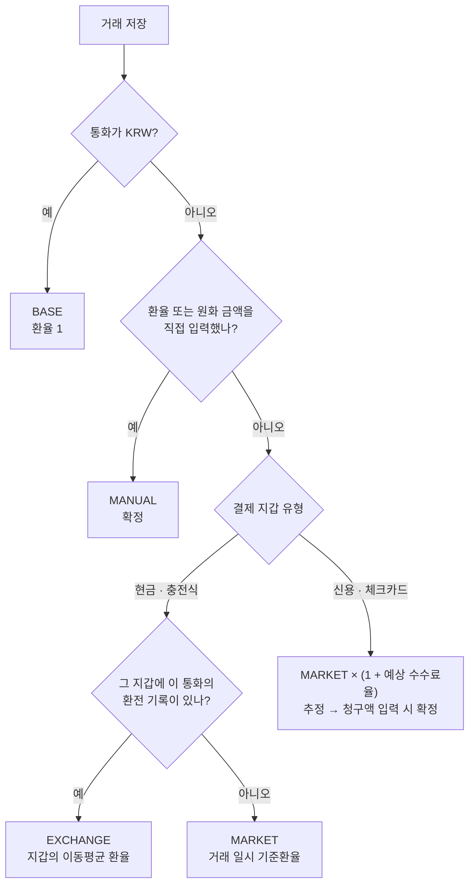

# 02. 구현 시 고려해야 할 변수

> [01 문서](01-architecture.md)의 구조 위에서, 실제로 구현할 때 정하거나 처리해야 하는 변수를 정리한다.
> 각 항목은 `V-번호`로 부르고 **권장안**을 함께 적는다. **[결정 필요]** 표시는 서비스 방향에 따라 답이 달라질 수 있어 확인이 필요한 항목이다.

## 0. 핵심 결정 요약

| # | 변수 | 권장안 | 관련 |
|---|---|---|---|
| 1 | 환전 환율이 적용되는 거래 | **현금·충전식 카드(트래블카드)** 로 낸 거래만. 신용카드는 현재 환율로 추정 | [V-12](#v-12-환전-환율이-적용되는-거래-범위-결정-필요) |
| 2 | 같은 통화를 여러 번 환전했을 때 | 지갑별 **이동평균** 환율 | [V-13](#v-13-같은-통화를-여러-번-환전했을-때-결정-필요) |
| 3 | 신용카드 해외 결제의 원화 금액 | 등록할 때는 **추정**, 청구서 원화 금액을 넣으면 **확정** | [V-18](#v-18-해외-카드-결제의-원화-금액-결정-필요) |
| 4 | "현재 환율"의 의미 | 입력한 시점이 아니라 **거래 일시** 기준의 매매기준율 | [V-10](#v-10-환율의-종류), [V-23](#v-23-현재-환율의-기준-시점) |
| 5 | 현재 환율 데이터 소스 | 한국수출입은행(22개 통화) + 보조 API(그 외 통화) | [V-20](#v-20-데이터-소스) |
| 6 | 반올림 | **거래마다** 원 미만 반올림해서 저장 | [V-27](#v-27-반올림-위치), [V-28](#v-28-반올림-방식) |
| 7 | 환전 기록의 집계 | 환전은 **지출이 아니다**. 지출 합계에서 뺀다 | [V-30](#v-30-집계-대상) |
| 8 | 로그인 없는 MVP의 데이터 보존 | **CSV 내보내기 + 백업 파일**을 MVP에 포함 | [V-40](#v-40-백업과-내보내기-결정-필요) |

---

## 1. 통화와 금액 표현

### V-01 통화별 소수 자릿수

통화마다 최소 단위(ISO 4217 minor unit)가 다르다. 금액을 정수로 저장하려면 통화별 자릿수를 알아야 한다. 그런데 ISO 값과 실제로 쓰는 자릿수가 다른 통화가 있다.

| 통화 | ISO 자릿수 | Intl(ko-KR) 기본 표시 | 실제 사용 |
|---|---|---|---|
| KRW · JPY · VND | 0 | `₩1,235` · `JP¥1,235` · `₫1,235` | 0 |
| USD · EUR | 2 | `US$1,234.57` · `€1,234.57` | 2 |
| IDR | 2 | `IDR 1,234.57` | 사실상 0 (소수 단위를 쓰지 않음) |
| TWD · HUF | 2 | `NT$1,234.57` · `HUF 1,234.57` | 현금은 사실상 0 |
| BHD · KWD | 3 | `BHD 1,234.567` | 3 |

**권장**
- 앱 안에 자체 통화 테이블(`src/core/domain/currency.ts`)을 두고 값을 분리한다.
  - `minorUnit`: 저장용. ISO 값을 그대로 쓴다 (IDR = 2).
  - `inputDigits`: 입력·표시용. 실제 사용 기준 (IDR = 0).
  - `rateDisplayUnit`: 환율 표시 단위 (JPY·IDR·VND = 100, 그 외 1). [V-08](#v-08-환율-표시-단위-100엔당) 참고.
- `Intl.NumberFormat`의 기본 자릿수에 기대지 않고 `minimumFractionDigits`·`maximumFractionDigits`를 항상 명시한다.

### V-02 통화 기호와 표기

- ko-KR의 `symbol` 표기는 겹치는 기호를 구분해 준다: `US$`, `AU$`, `CA$`, `HK$`, `JP¥`, `CN¥`.
- `narrowSymbol` 표기는 이 통화들이 모두 `$`, `¥`가 되어 구분되지 않는다.
- THB, SGD, CHF 같은 일부 통화는 코드(`THB 1,234.57`)로 나온다.

**권장**
- 금액에는 `currencyDisplay: 'symbol'`(ko-KR)을 쓴다.
- 통화 선택 목록과 합계 카드에는 한글 통화명(미국 달러)을 함께 보여준다.
- 위 출력은 Node(ICU)에서 확인한 값이다. 앱 엔진(Hermes)의 Intl 결과가 다를 수 있으니 **실제 기기에서 포맷 스냅샷 테스트**로 고정한다.

### V-03 금액 크기와 정수 범위

- JS `Number`가 정확히 나타내는 정수 상한은 약 9,007조(2^53 − 1)이고, SQLite INTEGER는 64비트다.
- 큰 금액 예: 1억 동(VND) → `100000000`, 1억 루피아(IDR, minorUnit 2) → `10000000000`. 둘 다 범위 안이다.
- 위험한 곳은 저장값이 아니라 **곱셈 중간값**(금액 × 환율)의 부동소수점 오차다.

**권장**: 저장·조회는 정수 그대로 하고, 곱셈·나눗셈·반올림은 모두 `Money` 도메인 함수(decimal.js) 안에서만 한다. 한 거래의 입력 상한도 검증한다.

### V-04 금액 입력 방식

- 소수점 키패드(`decimal-pad`)를 쓰고, `inputDigits`보다 긴 소수 입력은 막는다 (USD 소수 3자리, KRW 소수점 등).
- 기기 언어가 독일어 등이면 소수점이 쉼표다. 입력 파서는 기기 locale의 소수 구분자를 받아들인다.
- 음수 입력은 막는다. 환불은 부호가 아니라 거래 유형(REFUND)으로 표현한다 ([V-35](#v-35-환불과-취소)).
- 통화 기본값: 가계부의 주 통화(도쿄 여행 → JPY), 그다음 마지막으로 쓴 통화.

### V-05 지원 통화 범위

| 소스 | 제공 통화 | 빠진 통화 |
|---|---|---|
| 한국수출입은행 | 22개 외화: USD, EUR, JPY(100), CNH, GBP, HKD, AUD, CAD, CHF, SGD, NZD, THB, MYR, IDR(100), SAR, AED, KWD, BHD, BND, NOK, SEK, DKK | **VND, TWD, PHP** 등. 위안화는 CNY가 아닌 **CNH(역외)** |
| ECB (Frankfurter) | 약 30개, KRW·PHP 포함 | VND, TWD 등 |
| ExchangeRate-API | 160개 이상 | — |

한국인이 많이 가는 베트남·대만 통화가 공시 소스에 없다. 그래서 보조 소스가 반드시 필요하다.

**권장**
- 통화 테이블에는 ISO 4217 통화를 두고, "현재 환율 제공 여부"는 서버 데이터로 판단한다.
- 현재 환율이 없는 통화도 기록은 할 수 있게 한다 (환율 직접 입력 또는 환전 기록).
- 사용자에게는 **CNY**로 보여주고, 수출입은행의 CNH 환율을 CNY에 매핑한다. 차이는 작지만 출처에 표시한다.

### V-06 원화 거래가 섞인 경우

여행 가계부에도 원화 지출이 있다 (항공권, 국내 공항, 로밍 요금).

**권장**: 통화가 KRW이면 환율 1, `rate_source = BASE`로 저장하고 환산을 건너뛴다. 통화별 합계에는 `KRW` 행으로 나오고 원화 총액에도 그대로 더해진다.

---

## 2. 환율 표현과 정밀도

### V-07 환율 방향

"1 USD = 1,380원"과 "1원 = 0.000725 USD"는 같은 정보다. 방향이 섞이면 계산이 틀어진다.

**권장**: 저장은 항상 **외화 1단위당 원화**로 한다. ECB는 EUR 기준, ExchangeRate-API는 요청한 기준 통화(예: USD)로 주므로 서버에서 수집할 때 변환한다.

### V-08 환율 표시 단위 (100엔당)

한국에서는 엔화·루피아를 100단위로 고시하고 그렇게 인식한다 (수출입은행 `JPY(100)`, `IDR(100)`). 동(VND)도 보통 100동 단위로 말한다.

**권장**
- 저장: 1단위당 (`JPY → "9.0512"`).
- 표시·입력: `rateDisplayUnit` 기준 (`100엔 = 905.12원`).
- 서버에서 `JPY(100)` 같은 단위 표기를 파싱해 1단위로 나눈다.
- 입력 화면에 "100엔당"을 크게 보여주고, [V-25](#v-25-환율-이상치-검증) 검증으로 `9.05`/`905` 혼동을 한 번 더 막는다.

### V-09 환율 정밀도

1 VND ≈ 0.05원처럼 1보다 작은 환율이 있다. 소수 2자리로 자르면 큰 금액에서 오차가 커진다.

> 10,000,000동 × 0.0525 = 525,000원, × 0.05253 = 525,300원 → **300원 차이**

**권장**: 환율은 10진 문자열로 **소수점 아래 최대 8자리**까지 저장한다. 평균·교차 환율 계산 결과는 8자리에서 반올림한다. 화면에는 표시 단위 기준 소수 2자리(`1,380.25원`, `100엔 = 905.12원`)로 보여준다.

### V-10 환율의 종류

| 종류 | 의미 | 쓰이는 곳 | 데이터 확보 |
|---|---|---|---|
| 매매기준율 | 은행 고시의 기준값(중간값) | 참고값, 통계 | 수출입은행 API (`deal_bas_r`) |
| 현찰 살 때 / 팔 때 | 매매기준율 ± 현찰 스프레드 (통화·은행·우대율마다 다름) | 은행 창구 환전 | 은행별 고시 (공식 API 없음) |
| 송금 보낼 때(TTS) / 받을 때(TTB) | 전신환 매도율 / 매입율 | 해외송금, 카드 원화 청구 계산 | 수출입은행 API (`tts`, `ttb`) |
| 카드 청구 환율 | 현지통화 → USD(국제브랜드) → 원화(카드사) + 수수료 | 신용·체크카드 해외 결제 | 청구서에서만 확인 가능 |
| 트래블카드 충전 환율 | 충전할 때 회사가 고시한 환율 | 외화 충전식 카드 | 사용자가 환전 기록으로 입력 |

**권장**
- 앱의 "현재 환율(MARKET)"은 **매매기준율**로 정의하고, 화면에 "기준환율 · 참고용"이라고 표시한다.
- 실제로 낸 돈과의 차이는 환전 기록(EXCHANGE)과 직접 입력(MANUAL)으로 맞춘다. 현찰 환율을 따로 구하지 않아도 사용자가 환전 기록에 실제 받은 금액을 넣으면 정확해진다.
- [결정 필요] 현재 환율에 "스프레드 %"를 더해 현찰 환율처럼 보이게 하는 설정 → **MVP 제외** 권장.

---

## 3. 환율 결정 규칙 (R2 · R3의 핵심)

### V-11 우선순위



| 순위 | `rate_source` | 조건 |
|---|---|---|
| — | `BASE` | 거래 통화가 KRW |
| 1 | `MANUAL` | 환율 또는 원화 금액을 직접 입력함 |
| 2 | `EXCHANGE` | 결제 지갑이 현금·충전식이고, 그 지갑에 이 통화의 환전 기록이 있음 |
| 3 | `MARKET` | 그 밖의 모든 경우 (신용·체크카드 포함) |

`MANUAL`은 두 가지로 입력할 수 있다.

- **환율 입력**: 원화 금액을 계산한다.
- **원화 금액 입력**: 카드 청구액이나 원화결제(DCC) 영수증 금액을 넣는 경우다. 원화 금액을 그대로 저장하고 환율은 화면 표시용으로만 역산한다. 역산한 환율로 다시 원화를 계산하면 반올림 때문에 1원씩 어긋날 수 있어서다.

### V-12 환전 환율이 적용되는 거래 범위 [결정 필요]

환전 기록이 있다고 모든 외화 거래에 환전 환율을 쓰면 틀린다. 신용카드로 낸 돈은 환전한 현금과 상관이 없다.

**권장: 지갑(결제수단) 개념을 둔다.**

| 지갑 유형 | 예 | 잔액 관리 | 적용 환율 |
|---|---|---|---|
| `CASH` | 환전한 현금 | 환전하면 늘고 쓰면 준다 | 지갑의 환전 평균 (`EXCHANGE`) |
| `PREPAID` | 트래블월렛·트래블로그 같은 외화 충전식 카드, 외화통장 연결 체크카드 | 충전하면 늘고 결제하면 준다 | 지갑의 충전 평균 (`EXCHANGE`) |
| `CARD` | 일반 신용·체크카드 | 없음 | 현재 환율로 추정 → 청구 시 확정 ([V-18](#v-18-해외-카드-결제의-원화-금액-결정-필요)) |

- 환전 기록은 반드시 "어느 지갑에 들어갔는지"를 가진다. 은행 현금 환전과 트래블카드 충전은 환율이 다르므로 섞지 않는다.
- 대안인 "거래마다 환전 기록을 직접 선택"은 입력이 번거롭고 잔액을 계산할 수 없어 권장하지 않는다.

### V-13 같은 통화를 여러 번 환전했을 때 [결정 필요]

예시 (현금 지갑, USD):

| 날짜 | 이벤트 |
|---|---|
| 10/1 | 환전 ①: 690,000원 → USD 500 (1,380.00) |
| 10/3 | 지출 USD 400 |
| 10/4 | 환전 ②: 420,000원 → USD 300 (1,400.00) |
| 10/5 | 지출 USD 300 |

| 정책 | 10/3 지출 USD 400 | 10/5 지출 USD 300 | 남은 USD 100 | 특징 |
|---|---|---|---|---|
| **총평균** (전체 환전 평균 1,387.50) | 555,000원 | 416,250원 | 138,750원 | 설명이 가장 쉽다. 그러나 **환전이 추가될 때마다 과거 거래 금액이 바뀐다** (10/3 기록이 552,000 → 555,000원) |
| **이동평균** (남은 잔액의 평균 단가) | 552,000원 (1,380) | 418,500원 (1,395) | 139,500원 | 거래 하나에 환율 하나. 나중에 한 환전이 이미 저장한 거래를 바꾸지 않는다 |
| **선입선출** (FIFO) | 552,000원 (1,380) | 418,000원 (100×1,380 + 200×1,400) | 140,000원 | 가장 정확하지만 한 거래가 두 환율로 쪼개져 표시·수정이 복잡하다 |
| 최근 환전 환율 | 552,000원 | 420,000원 | — | 원화 합계가 실제 환전액과 어긋난다 |

총평균·이동평균·FIFO는 모두, 외화를 다 쓰면 원화 합계가 실제 환전에 쓴 금액(1,110,000원)과 정확히 맞는다.

**권장: 이동평균**
1. 환전을 나중에 추가해도 이미 저장한 거래가 바뀌지 않는다. 01 문서의 스냅샷 원칙과 맞다.
2. 거래마다 환율이 하나라서 화면과 데이터가 단순하다.
3. "남은 현금 USD 100 · 평균 1,395원" 같은 잔액 정보를 자연스럽게 보여줄 수 있다.
4. 원화 합계가 실제 환전액과 맞는다.

**구현 메모**
- (가계부, 지갑, 통화) 단위로 환전·지출·수입을 시간순으로 다시 재생(replay)해서 계산한다. 개인 가계부 규모(수백~수천 건)는 매번 전체를 다시 계산해도 충분히 빠르다.
- 같은 시각이면 환전을 먼저, 지출을 나중에 처리한다.
- 환전 시점의 잔액이 0 이하이면 새 평균 = 그 환전의 환율로 초기화한다 (음수 잔액과 섞으면 평균이 비정상적으로 튄다).

### V-14 환전한 것보다 더 많이 쓴 경우

원인: 환전 기록 누락, ATM 인출 미기록, 현금 수입 미기록 등.

**권장**
- 잔액이 0 아래로 내려가도 저장은 허용하고, 직전 평균 단가를 적용한다.
- 지갑에 "잔액 부족 −USD 20" 경고와 "환전 기록 추가" 바로가기를 보여준다.
- 지갑에 환전 기록이 하나도 없으면 `MARKET`을 쓴다.

### V-15 재계산 규칙

> 원칙: **시장 환율이 움직였다고 저장된 원화 금액이 바뀌지는 않는다.** 그 거래의 근거 데이터가 바뀔 때만 다시 계산한다.

| 이벤트 | 다시 계산되는 거래 | 처리 |
|---|---|---|
| 시장 환율 갱신 | 없음 (단, 추정 상태인 `MARKET` 거래는 [V-24](#v-24-오프라인과-오래된-환율)) | — |
| 환전 기록 추가·수정·삭제 | 같은 지갑·통화에서 그 환전 시각 **이후**의 `EXCHANGE` 거래 | 자동 재계산 |
| 과거 날짜의 현금·충전식 거래 추가·수정·삭제 | 같은 지갑·통화에서 그 시각 이후의 `EXCHANGE` 거래 (그 뒤에 환전이 있을 때만 값이 바뀐다) | 자동 재계산 |
| 거래의 금액만 수정 | 그 거래 | 환율은 그대로, 원화만 다시 계산 |
| 거래의 통화·일시·지갑 수정 | 그 거래 (+ 위 규칙) | 환율을 다시 결정 |
| `MANUAL` 거래 | 대상 아님 | 사용자가 직접 고칠 때만 바뀐다 |

[결정 필요] 자동 재계산 vs 매번 확인 → **자동 재계산 + "원화 금액 N건 갱신됨" 안내 + 되돌리기** 권장.

### V-16 환전 기록 입력 방식

사용자가 아는 정보는 경우마다 다르다. 영수증의 원화·외화 금액, 은행 앱의 적용 환율, 별도로 낸 수수료 등.

**권장**
- 기본 입력: **낸 원화 금액 + 받은 외화 금액**. 실효 환율 = 원화 ÷ 외화. 수수료와 우대율이 모두 반영된 진짜 환율이다.
- 보조 입력: 환율 + 한쪽 금액 → 나머지를 자동 계산 (사용자가 고칠 수 있음).
- 저장의 기준은 **두 금액**이고, 환율은 두 금액에서 계산한 값(8자리)이다.
- 수수료를 따로 낸 경우(예: 환전 수수료 5,000원 별도)는 "수수료" 칸에 넣고 원화 금액에 합쳐 실효 환율을 계산한다. 그래야 원화 총 사용액에 수수료가 들어간다.

### V-17 환전의 종류

| 종류 | 예 | 처리 | 시기 |
|---|---|---|---|
| 원화 → 외화 (현금) | 은행·공항 환전 | `CASH` 지갑에 환전 기록 | MVP |
| 원화 → 외화 (충전) | 트래블카드 충전 | `PREPAID` 지갑에 환전 기록 | MVP |
| 해외 ATM 인출 | 원화 계좌에서 현지 현금 인출 | 빠져나간 원화(수수료 포함) + 받은 현지 통화로 입력 → 위와 같음 | MVP |
| 외화 → 원화 (재환전) | 남은 달러를 원화로 | MVP: 평균 단가는 두고 잔액만 줄인다. 환차손익 표시는 Phase 2 | MVP / Phase 2 |
| 외화 → 외화 | 현지에서 USD → VND | 원가를 넘겨받는 계산이 필요 | Phase 2 |

---

## 4. 카드 결제

### V-18 해외 카드 결제의 원화 금액 [결정 필요]

카드 결제의 원화 금액은 결제하는 순간 정해지지 않는다.

- **확정 시점**: 결제(승인) 날이 아니라, 가맹점이 매출표를 접수한 날(매입일)의 환율이 적용된다.
- **환산 경로**: 현지통화 → USD(국제브랜드) → 원화(카드사, 전신환 매도율 기준)로 두 번 환산된다.
- **수수료**: 국제브랜드 수수료(Visa 1.1%, Mastercard 1.0%, AMEX 1.4% 등)에 카드사 해외서비스 수수료가 더해진다. 합치면 보통 1%대다. 정확한 값은 카드 상품설명서로 확인한다.
- **원화결제(DCC)**: 현지에서 원화로 결제하면 가맹점 쪽 수수료 약 3~8%가 추가된다.

**권장**
1. 등록할 때: `MARKET 환율 × (1 + 지갑의 예상 수수료율)`로 **추정** 저장 (`rate_status = ESTIMATED`). 금액 앞에 `≈`를 붙인다.
2. 카드 지갑 설정에 "예상 수수료율" 칸을 둔다. 기본값 0%, 사용자가 예컨대 1.4%로 바꿀 수 있다.
3. 청구서를 받은 뒤 "원화 청구액"을 넣으면 `MANUAL`(원화 금액 입력형), `rate_status = CONFIRMED`로 바뀐다.
4. 홈 화면에 "확정 대기 N건"을 보여준다.

대안: 추정 없이 기준환율로만 두기. 단순하지만 실제 청구액보다 1~2% 적게 보인다.

### V-19 원화결제(DCC)

해외 가맹점에서 원화로 결제하면 영수증에 원화 금액(수수료 포함)이 찍힌다.

**권장**: 외화 금액(현지 가격)과 원화 금액을 둘 다 입력받아 `MANUAL`로 저장한다. 원화 총액에는 실제 낸 돈이, 통화별 합계에는 현지 통화 금액이 들어간다. "원화결제" 표시를 남겨 두면 나중에(Phase 2) "원화결제로 더 낸 금액" 통계를 낼 수 있다.

---

## 5. 현재 환율 데이터 (MARKET)

### V-20 데이터 소스

| 소스 | 통화 | 환율 종류 | 갱신 | 인증 · 제약 |
|---|---|---|---|---|
| **한국수출입은행** 현재환율 API | 22개 외화 | 매매기준율, TTB, TTS | 영업일 오전 11시경 하루 1회 | 인증키 필요, 일일 호출 한도. 11시 이전·비영업일 요청은 빈 값. 요청 도메인이 `oapi.koreaexim.go.kr`로 바뀜 (2025-06-25, 구 도메인 2026-04-30 종료) |
| **ECB** (Frankfurter) | 약 30개 (KRW 포함) | ECB 기준환율 | 영업일 16시(CET)경 | 키 없음 |
| **ExchangeRate-API** Open Access (`open.er-api.com`) | 160개 이상 | 시장 중간값 | 하루 1회 | 키 없음. **출처 표기 의무**. 과다 호출 시 HTTP 429 |

**권장**
- 통화마다 **출처를 하나로 고정**한다. 수출입은행이 제공하는 통화는 수출입은행, 나머지(VND, TWD 등)는 ExchangeRate-API. 날마다 출처가 바뀌면 같은 통화의 환율이 출렁거려 보인다.
- 수출입은행 장애(오류, 타임아웃, 인증 실패)가 이어질 때만 그 통화도 보조 소스로 대체하고 `source`에 남긴다.
- 앱 설정에 "환율 정보 출처" 화면을 두고 출처와 링크를 표시한다.

### V-21 교차 환율

ExchangeRate-API를 USD 기준으로 받으면 원화 환율은 교차 계산해야 한다.

> KRW per VND = (USD → KRW) ÷ (USD → VND)

**권장**: 서버에서 decimal로 계산하고 8자리에서 반올림한다. 같은 응답 안의 값끼리만 계산하고, 서로 다른 시각에 받은 값은 섞지 않는다.

### V-22 수집 주기와 휴일

수출입은행은 영업일 11시경 하루 한 번 고시한다. 주말·공휴일엔 새 값이 없다.

> 예: 2026-10-09(금)은 한글날이다. 10/8(목) 환율이 10/12(월) 11시까지 "현재 환율"이다.

**권장**
- cron: 평일 11:10, 12:00, 15:00(KST)에 시도한다. 빈 응답이면 다음 시도를 기다린다. 보조 소스는 하루 1~2회.
- 서버 테이블: `(currency, rate_date, source)` 유니크, 고시 시각 `effective_at`과 수집 시각 `fetched_at`을 저장한다.
- 빈 응답은 오류가 아니다. 이전 값을 그대로 둔다.
- 응답 파싱 주의: 수출입은행 응답은 숫자가 쉼표 포함 문자열(예: `"1,380.5"`)이고, 단위가 통화 코드에 붙어 온다(`JPY(100)`). 정규화 함수에서 처리하고 **실제 응답 샘플로 테스트**한다.

### V-23 "현재 환율"의 기준 시점

같은 "현재 환율"이라도 입력한 시점이냐 거래한 시점이냐에 따라 다르다. 여행에서 돌아와 몰아서 입력하면 차이가 커진다.

**권장: 거래 일시 기준.** 거래 시각(UTC) 이전에 고시된 가장 최근 환율(`effective_at ≤ occurred_at`)을 쓴다.

- 예: 뉴욕에서 10/5(월) 21:00 결제 = 한국 10/6(화) 10:00 → 10/6 고시(11시) 전이므로 **10/5 환율**.
- 미래 날짜 거래(예약 결제 등): 최신 환율로 추정(`ESTIMATED`).
- 과거 날짜 거래를 위해 서버는 **일자별 이력**을 조회할 수 있어야 한다. 앱 캐시에는 가계부 기간의 이력만 저장한다.

### V-24 오프라인과 오래된 환율

| 상황 | 처리 |
|---|---|
| 캐시가 거래 시각 이후에 동기화됨 | 거래 시각의 환율을 정확히 알고 있음 → 그대로 사용 |
| 캐시의 마지막 동기화가 거래 시각보다 이전 | 더 새로운 고시가 있었을 수 있음 → 가장 최근 캐시로 계산, `ESTIMATED` + "기준: 10/2 환율" 표시 |
| 캐시가 비어 있음 (첫 실행이 오프라인) | 앱에 넣어 둔 **기본 환율(빌드 시점)** 사용, `ESTIMATED` |
| 다시 온라인이 됨 | 추정 상태인 `MARKET` 거래를 거래 일시의 정확한 환율로 **자동 보정** |

- 자동 보정은 [V-15](#v-15-재계산-규칙) 원칙과 충돌하지 않는다. `MARKET`의 정의가 "거래 일시의 기준환율"이므로, 늦게 도착한 정답으로 채우는 것이다.
- 카드 추정 거래([V-18](#v-18-해외-카드-결제의-원화-금액-결정-필요))는 시장 환율이 보정돼도 청구액을 넣기 전까지 `ESTIMATED`로 남는다.
- 환율 조회 시점: 앱 실행·포그라운드 진입 시, 그리고 마지막 조회 후 6시간이 지났을 때.

### V-25 환율 이상치 검증

- **서버**: 0, 음수, 빈 값은 저장하지 않는다. 직전 영업일보다 ±10% 넘게 변하면 저장을 보류하고 알린다 (실제 급변이면 수동 승인).
- **앱 (직접 입력, 환전 기록)**: 기준환율보다 ±20% 넘게 벗어나면 확인 창을 띄운다. 100엔 단위 혼동(`9.05`/`905`)과 자릿수 오타를 여기서 잡는다.

### V-26 운영 리스크

| 리스크 | 대응 |
|---|---|
| API 키 유출 | 키는 Supabase Edge Function 비밀 값으로만 보관. 앱에는 읽기 전용 anon 키만 넣는다 |
| API 정책·도메인 변경 | 수출입은행은 이미 한 번 도메인을 바꿨다. 제공자 모듈을 분리해 교체할 수 있게 한다 (01 문서 `supabase/functions/fetch-rates/providers/`) |
| Supabase 무료 플랜 일시정지 | 무료 플랜은 7일간 활동이 적으면 프로젝트를 일시정지하고, 그러면 pg_cron도 멈춘다. 출시할 때는 유료 플랜이나 외부 헬스체크를 둔다 |
| 수집 중단을 늦게 알아챔 | "최신 환율이 2영업일 넘게 갱신되지 않음" 알림 |
| 과다 호출 | 앱은 우리 DB만 읽는다. 외부 API는 cron만 호출한다 |

---

## 6. 환산과 반올림

### V-27 반올림 위치

> 예: USD 0.99 거래 3건, 환율 1,385.40
> - 거래마다 반올림: 1,371.546 → 1,372원 × 3 = **4,116원**
> - 합계 후 반올림: 2.97 × 1,385.40 = 4,114.638 → **4,115원**

**권장**: 거래마다 반올림해서 `base_amount_minor`에 저장하고, 합계는 저장값을 더한다. 목록에 보이는 원화를 직접 더해도 총액과 정확히 같다. 합계 후 반올림한 값과의 1원 단위 차이는 받아들인다.

### V-28 반올림 방식

**권장**
- 원 미만은 반올림하고, 정확히 0.5이면 0에서 먼 쪽으로 보낸다 (decimal.js `ROUND_HALF_UP`). 환불과 원거래가 같은 크기로 반올림되어 정확히 상쇄된다.
- 평균·교차 환율은 소수 8자리에서 반올림한다.
- 카드 청구액처럼 외부에서 확정된 원화는 반올림 없이 그대로 저장한다.

### V-29 환산 공식

```ts
import Decimal from 'decimal.js';

// 외화 금액(최소 단위 정수) × 환율 → 원화(최소 단위 정수)
export function toBaseAmount(amountMinor: number, currency: CurrencyCode, rate: string): number {
  return new Decimal(amountMinor)
    .div(Decimal.pow(10, minorUnit(currency))) // 2550 → 25.50
    .mul(rate)                                 // × 1380.00
    .mul(Decimal.pow(10, minorUnit('KRW')))    // KRW는 0자리
    .toDecimalPlaces(0, Decimal.ROUND_HALF_UP)
    .toNumber();                               // 35190
}
```

> 예: 1,500엔 × 9.0512 (100엔 = 905.12원) = 13,576.8 → **13,577원**

---

## 7. 합계 · 잔액 · 화면 표시

### V-30 집계 대상

| 기록 | 지출 합계 | 원화 총액 | 지갑 잔액 (현금·충전식) |
|---|---|---|---|
| 지출 `EXPENSE` | + | + | − |
| 수입 `INCOME` | 별도 합계 | 별도 합계 | + |
| 환불 `REFUND` | − (원거래 상쇄) | − | + |
| 환전 | **제외** | **제외** | + |

환전을 지출로 세면 이중 집계가 된다. 690,000원을 환전하고 USD 400을 썼다면 지출은 552,000원이다. 690,000 + 552,000원이 아니다.

[옵션] "환전에 쓴 원화 총액"은 참고 지표로 따로 보여줄 수 있다.

### V-31 홈 화면 구성 (R4)

- **원화 환산 총 지출** (가장 크게). 추정이 섞여 있으면 `≈`
- **통화별 지출 합계**: `USD 312.40` · `JPY 18,500` · `KRW 120,000`
- **지갑별 남은 외화와 평균 단가**: `현금 USD 100 · 평균 1,395.00원`
- **확정 대기 카드 결제 N건**
- 카테고리별·일자별 통계

### V-32 원화 총액의 평가 기준

기록 기준(저장된 스냅샷의 합)과 오늘 환율 기준(재평가) 중 무엇을 보여줄지.

**권장**: 기본은 기록 기준. "오늘 환율이면 ₩X (차이 ±Y)" 같은 재평가는 Phase 2 보조 지표로 둔다.

### V-33 추정치 표시

- 추정(`ESTIMATED`) 거래가 하나라도 섞인 합계는 숫자 앞에 `≈`를 붙이고, 누르면 추정 거래 목록을 보여준다.
- 거래 목록 각 행에 환율 출처 배지를 단다: `직접 입력` · `환전 평균` · `기준환율` · `추정`.

### V-34 외화 수입

예: 택스리펀 현금 수령, 현지에서 받은 돈.

**권장**: 현금·충전식 지갑의 외화 수입은 잔액을 늘린다. 이동평균 계산에서는 그 거래의 스냅샷 환율(보통 `MARKET`)로 들어온 환전처럼 다룬다.

### V-35 환불과 취소

**권장**
- 결제 취소·부분 환불은 음수 금액이 아니라 `REFUND` 유형으로 입력하고 원거래에 연결한다 (`refund_of_id`).
- 기본 환율은 원거래의 적용 환율이다. 전액 환불이면 원화도 정확히 0으로 상쇄된다.
- 카드 환불은 실제 원화 환불액이 다를 수 있으므로 원화 금액 수정(`MANUAL`)을 허용한다.
- 원거래를 지울 때는 연결된 환불을 함께 지울지 묻는다.

---

## 8. 날짜와 시간대

### V-36 거래 시각 저장

**권장**: `occurred_at`(UTC ISO 문자열) + `timezone`(IANA, 예: `America/New_York`) 두 칸으로 저장한다. 화면에는 현지 시각으로 보여준다. 서머타임은 IANA 규칙이 처리한다.

### V-37 날짜 경계

- 일별 통계와 가계부 기간 필터는 **거래 현지 날짜** 기준이다. 뉴욕에서 23:30에 결제했다면 한국 시각으로는 다음 날이지만 여행 일정상 그날의 지출이다.
- 환율 조회는 [V-23](#v-23-현재-환율의-기준-시점)대로 **UTC 시각** 기준이다. 두 기준이 다르다는 점을 테스트로 고정한다.

### V-38 시간대 기본값

- 가계부에 기본 시간대를 저장한다 (도쿄 여행 → `Asia/Tokyo`).
- 새 거래의 기본값은 기기의 현재 시간대이고, 사용자가 바꿀 수 있다.
- 여러 나라를 도는 여행처럼 거래마다 시간대가 달라도 문제없게 한다.

---

## 9. 데이터 변경과 보존

### V-39 삭제

- 소프트 삭제(`deleted_at`)로 처리하고, "최근 삭제"에 30일 보관한 뒤 영구 삭제한다.
- 현금·충전식 거래나 환전 기록의 삭제도 이동평균 재계산 대상이다 ([V-15](#v-15-재계산-규칙)).

### V-40 백업과 내보내기 [결정 필요]

MVP는 로그인이 없어서 데이터가 기기에만 있다. 폰을 잃어버리거나 바꾸면 전부 잃는다.

**권장**
- MVP에 **CSV 내보내기**를 넣는다. 컬럼: 일시, 시간대, 통화, 외화 금액, 적용 환율, 환율 출처, 원화 금액, 지갑, 카테고리, 메모.
- MVP에 **백업 파일 만들기·복원**을 넣는다. 공유 시트로 iCloud Drive·Google Drive 등에 저장한다.
- iOS·Android 기본 기기 백업에 앱 DB가 포함되는지 실제로 확인한다.

### V-41 스키마 마이그레이션

- 앱 시작 시 Drizzle 마이그레이션을 실행한다. 실패하면 DB를 백업해 두고 안내한다.
- 이전 버전 DB로 시작하는 업그레이드 경로를 테스트에 넣는다.
- 컬럼 삭제처럼 되돌릴 수 없는 변경은 최소 한 버전 동안 미룬다.

### V-42 통화 데이터 변경

화폐 개혁(디노미네이션)이나 새 통화는 드물다. 통화 테이블은 앱 코드에, 현재 환율 제공 여부는 서버 데이터에 두어 각각 업데이트로 대응한다.

---

## 10. 보안과 개인정보

### V-43 앱 잠금

생체인증·PIN 잠금(`expo-local-authentication`)을 MVP에 넣고 설정에서 켜게 한다. 앱 전환 화면(최근 앱 목록)에서는 금액을 가린다.

### V-44 로컬 DB 암호화

`expo-sqlite`는 SQLCipher 옵션을 제공한다. 다만 키를 잃으면 복구할 수 없고, 백업 파일 암호화와 함께 설계해야 한다.

**권장**: 기기 자체 암호화가 있으므로 MVP는 앱 잠금까지만 하고, DB 암호화는 Phase 2에서 백업 암호화와 함께 한다.

### V-45 로그와 개인정보

- Sentry 등 모니터링 도구에 금액, 메모, 가계부 이름을 보내지 않는다 (breadcrumb 필터).
- 앱스토어는 모든 앱에 개인정보처리방침 URL을 요구한다. 로그인이 없어도 준비한다.

---

## 11. 접근성과 표시

### V-46 스크린리더

`US$25.50`은 읽기 어색하다. 금액 컴포넌트(`AmountText`)에 `accessibilityLabel="25.50 미국 달러"`처럼 통화 이름을 풀어 쓴다.

### V-47 긴 숫자

VND·IDR은 금액이 길다 (`₫12,500,000`). 큰 글씨 모드에서도 잘리지 않도록 합계 카드는 글자 크기 자동 축소와 줄바꿈 규칙을 정한다. 한국식 단위 축약(`1,250만 동`)은 옵션으로 둔다.

---

## 12. 경계 케이스 테스트 목록

`src/core/domain`의 단위 테스트와 Maestro E2E에서 최소한 아래를 확인한다.

| # | 시나리오 | 기대 결과 |
|---|---|---|
| 1 | KRW 30,000원 거래 | 환율 1, `BASE`, 원화 30,000 |
| 2 | USD 25.50, 환전 평균 1,380 | 35,190원 |
| 3 | JPY 1,500, 100엔 = 905.12원 | 13,577원 |
| 4 | BHD 1.234 입력 | `amount_minor = 1234` |
| 5 | IDR 금액에 소수점 입력 | 입력 불가, 저장은 ×100 |
| 6 | USD 0.50 × 1,381.00 = 690.5 | 691원 (0.5 올림) |
| 7 | 전액 환불 | 원거래와 합쳐 원화 0 |
| 8 | [V-13](#v-13-같은-통화를-여러-번-환전했을-때-결정-필요) 예시 (환전 2회) | 552,000원 / 418,500원, 잔액 USD 100 · 평균 1,395 |
| 9 | 과거 날짜 환전 추가 | 그 이후 현금 거래만 재계산, 이전 거래는 그대로 |
| 10 | 환전보다 많이 사용 | 저장됨 + 잔액 부족 경고, 직전 평균 적용 |
| 11 | 신용카드 결제 후 청구액 입력 | `ESTIMATED` → `CONFIRMED`, 원화 = 청구액 |
| 12 | 첫 실행이 오프라인 | 기본 환율 + `ESTIMATED`, 온라인 후 자동 보정 |
| 13 | 10/10(토) 결제 (한글날 연휴) | 10/8(목) 환율 |
| 14 | 뉴욕 10/5(월) 21:00 결제 | 10/5 환율 (한국 10/6 10:00, 고시 전) |
| 15 | 100엔 환율 칸에 `9.05` 입력 | 확인 창 |
| 16 | VND 거래 | 보조 소스 환율, 출처 표시 |
| 17 | USD 0.99 × 3건, 1,385.40 | 합계 4,116원 (행 합과 일치) |
| 18 | 환전 기록 삭제 | 이후 거래 재계산, 환전이 없어지면 `MARKET`으로 전환 + 안내 |

---

## 13. 결정이 필요한 항목

| # | 질문 | 권장 | 대안 |
|---|---|---|---|
| D1 | 환전 환율을 어떤 거래에 적용할까? ([V-12](#v-12-환전-환율이-적용되는-거래-범위-결정-필요)) | 현금·충전식 지갑 거래만 | 거래마다 환전 기록 선택 |
| D2 | 여러 번 환전하면 어떤 환율? ([V-13](#v-13-같은-통화를-여러-번-환전했을-때-결정-필요)) | 이동평균 | 총평균, 선입선출 |
| D3 | 카드 결제 원화는? ([V-18](#v-18-해외-카드-결제의-원화-금액-결정-필요)) | 추정 → 청구액 입력 시 확정 | 기준환율로 고정 |
| D4 | 환전 기록이 바뀌면? ([V-15](#v-15-재계산-규칙)) | 자동 재계산 + 안내 + 되돌리기 | 매번 확인 |
| D5 | MVP 데이터 보존 ([V-40](#v-40-백업과-내보내기-결정-필요)) | CSV + 백업 파일 | Phase 2 클라우드 동기화만 |
| D6 | 현찰 스프레드 설정 ([V-10](#v-10-환율의-종류)) | MVP 제외 | 설정 제공 |

---

## 14. 01 문서에 반영한 변경

이 문서의 권장안에 맞춰 [01 문서](01-architecture.md)를 고쳤다.

- 데이터 모델에 **지갑(WALLET)** 추가. 거래의 `exchange_id`·`payment_method` → `wallet_id`, 환전 기록에 `wallet_id`
- `rate_source`에 `BASE` 추가, `rate_status`(`ESTIMATED` / `CONFIRMED`) 추가, 거래에 `timezone`·`refund_of_id` 추가
- 환율 결정 흐름의 EXCHANGE 단계: "환전 기록 선택" → "지갑의 이동평균 환율"
- 환율 수집 파이프라인: 통화별 고정 출처, 장애 시에만 보조 소스로 대체
- 폴더 구조에 `features/wallets` 추가
- 단계별 범위: CSV 내보내기·백업, 카드 결제 확정을 MVP로 이동

---

## 참고 자료

- 한국수출입은행 현재환율 API: [공공데이터포털](https://www.data.go.kr/catalog/3068846/openapi.json), [한국수출입은행](https://www.koreaexim.go.kr)
- ECB 기준환율: [Euro foreign exchange reference rates](https://www.ecb.europa.eu/stats/policy_and_exchange_rates/euro_reference_exchange_rates/html/index.en.html)
- ExchangeRate-API Open Access: [Open Access Endpoint](https://www.exchangerate-api.com/docs/free)
- Supabase 무료 플랜 일시정지: [Project Pausing](https://supabase.com/docs/guides/platform/free-project-pausing)
- expo-sqlite (SQLCipher 옵션): [Expo SQLite](https://docs.expo.dev/versions/latest/sdk/sqlite/)
- 해외 카드 결제 환율·수수료: [한국씨티은행 해외이용 안내](https://www.citibank.co.kr/CrdInfoOvrs9100.act), [토스피드 — 해외에서 카드 vs ATM](https://toss.im/tossfeed/article/traveling-budget-4)
- 원화결제(DCC) 수수료: [시사경제](https://www.sateconomy.co.kr/news/view/179588708407901)
