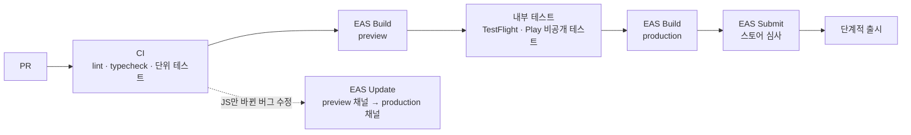

# 03. 기술 스택 검토 — 실제 배포 기준

> [01 문서](01-architecture.md)의 기술 스택이 프로토타입이 아니라 **실제 출시와 운영**까지 고려해도 최선인지 검토한다.
> [02 문서](02-implementation-variables.md)에서 확정한 결정(로컬 우선, 선입선출, 수출입은행 TTS 기반 카드 추정, 백업 파일 등)을 전제로 한다.

## 0. 결론 (확정)

**핵심 축은 그대로 간다.** 아래 6가지 조정까지 포함해 확정했다.

- 앱: **React Native + Expo + TypeScript**
- 데이터: **기기 안 SQLite (expo-sqlite + Drizzle)**
- 서버: **Supabase**

프레임워크를 바꿀 이유는 없다. 다만 실제 배포를 기준으로 보면 세부 구성은 아래 6가지를 조정하는 게 낫다.

| # | 조정 | 이유 |
|---|---|---|
| 1 | TanStack Query **제거** | 화면은 SQLite만 구독하고 환율도 SQLite에 저장하므로, 서버 상태 캐시 계층이 중복된다 |
| 2 | 금액 표시는 Intl 대신 **자체 포맷터** | 앱 엔진(Hermes)의 Intl은 기본 통화 포맷은 되지만 플랫폼·버전마다 결과가 다를 수 있다. 돈 표시가 기기마다 달라지면 안 된다 |
| 3 | NativeWind → **Unistyles 3** | NativeWind는 v4에서 v5로 넘어가는 중이라 곧 메이저 마이그레이션이 필요하다. Unistyles 3은 안정 버전이다 |
| 4 | Supabase **서울 리전** + 환율 수집 함수도 **서울에서 실행** | 수출입은행 API를 국내 IP에서 부르고, Phase 2에서 사용자 데이터를 국내에 보관한다 |
| 5 | 출시용 모듈 추가 | 카드 청구액 확인 알림(로컬 알림), 백업 파일 만들기·복원, 강제 업데이트 확인 |
| 6 | Phase 2 후보 확정 | 동기화는 PowerSync, 로그인은 Supabase Auth + Apple 로그인 + 카카오 로그인 |

> 개발자가 Dart/Flutter에 훨씬 익숙하다면 Flutter도 동등하게 좋은 선택이다. 둘 다 처음이거나 JS/TS가 익숙하다면 지금 스택이 낫다 ([2장](#2-앱-프레임워크-비교)).

---

## 1. 평가 기준

| 기준 | 이 앱에서 중요한 이유 |
|---|---|
| 데이터 신뢰성 | 돈 기록이다. 오프라인에서도 저장돼야 하고, 업데이트 중에 사라지면 안 된다 |
| 계산·표시 정확성 | 같은 금액이 iOS와 Android에서 다르게 보이거나 1원이라도 틀리면 신뢰를 잃는다 |
| 1인·소규모 개발 | iOS와 Android를 코드 하나로 동시에 내야 한다 |
| 출시 후 긴급 수정 | 계산 버그는 스토어 심사를 기다리지 않고 바로 고칠 수 있어야 한다 |
| 운영 부담과 비용 | 서버 관리가 적고, 사용자가 적을 때는 비용이 거의 없어야 한다 |
| Phase 2 확장 | 로그인, 클라우드 동기화, 공유 가계부로 자연스럽게 넘어가야 한다 |
| 한국 시장 | 원화 표기, 수출입은행 환율, 카카오 로그인, 국내 데이터 보관 |

---

## 2. 앱 프레임워크 비교

| 기준 | **React Native + Expo** | Flutter | 네이티브 (Swift + Kotlin) | Kotlin Multiplatform |
|---|---|---|---|---|
| 코드베이스 | 1개 | 1개 | 2개 | 1개 (UI 공유 가능) |
| 로컬 DB | expo-sqlite + Drizzle (마이그레이션, 화면 자동 갱신) | drift (매우 성숙) | SwiftData / Room | SQLDelight |
| 출시 후 긴급 수정 | **EAS Update로 심사 없이 수정** (무료 1,000 MAU) | Shorebird (별도 서비스) | 불가, 매번 심사 | 불가, 매번 심사 |
| 서버와 같은 언어 | **TypeScript 하나** | Dart + TypeScript | Swift + Kotlin + TypeScript | Kotlin + TypeScript |
| 빌드·스토어 제출 | **EAS Build/Submit** (클라우드 빌드, 무료 월 30회) | Codemagic 등 별도 구성 | Xcode, Gradle 직접 | 직접 구성 |
| 통화 표시 일관성 | Intl이 플랫폼별로 다를 수 있음 → 자체 포맷터로 해결 | intl 패키지에 CLDR 데이터 내장, 일관됨 | 플랫폼 API, 서로 다름 | 플랫폼 API |
| 홈 화면 위젯 | 네이티브 코드 일부 필요 | 네이티브 코드 일부 필요 | 가장 쉬움 | 네이티브 코드 필요 |
| 성능 | 가계부 수준엔 충분 | 충분 | 최고 | 충분 |
| 생태계 | 매우 큼 | 매우 큼 | 큼 | iOS 쪽은 아직 작음 |

**판단**
- 네이티브는 코드가 두 벌이라 1인·소규모 개발에 맞지 않는다. Kotlin Multiplatform은 iOS UI 생태계가 아직 작다.
- 현실적인 후보는 **RN + Expo**와 **Flutter** 둘이고, 기능상 거의 동급이다.
- RN + Expo가 앞서는 점: **공식 OTA 업데이트**(계산 버그를 바로 수정), **서버까지 TypeScript 하나**, **EAS로 빌드·제출 자동화**.
- Flutter가 앞서는 점: 통화 포맷 일관성, drift의 성숙도. 둘 다 이 앱에선 우회할 수 있는 차이다 (자체 포맷터, Drizzle).
- 그래서 **지금 스택을 유지**한다. 결정을 뒤집을 만한 변수는 개발자의 익숙함 하나다.

---

## 3. 구성 요소별 검토

| 영역 | 01 문서 | 판단 | 이유 |
|---|---|---|---|
| 앱 프레임워크 | React Native + Expo | **유지** | 2장 |
| 개발 방식 | (미정) | **개발 빌드(dev client) 사용** | Expo Go로는 SQLCipher, 위젯 같은 네이티브 모듈을 쓸 수 없다. 처음부터 개발 빌드로 간다 |
| 라우팅 | Expo Router | **유지** | 파일 기반 라우팅, 모달, 딥링크 |
| 로컬 DB | expo-sqlite + Drizzle | **유지** | 마이그레이션, 화면 자동 갱신. Phase 2 동기화 엔진(PowerSync)이 Drizzle을 지원한다 |
| 서버 상태 | TanStack Query | **제거** | 화면은 SQLite만 구독하고, 환율은 백그라운드 동기화가 SQLite에 쓴다. 같은 일을 두 번 하는 계층이다 |
| 클라이언트 상태 | Zustand | **유지** | 설정, UI 상태 |
| 금액 계산 | decimal.js | **유지** | |
| 금액 표시 | Intl.NumberFormat | **자체 포맷터로 변경** | 통화 테이블(기호, 자릿수)로 직접 만든다. 기본 통화 포맷은 Hermes에서도 되지만 플랫폼·버전마다 결과가 다를 수 있다. 앱이 한국어 전용이라 직접 구현해도 간단하다 |
| 날짜·시간대 | date-fns + date-fns-tz | **유지** (date-fns v4의 `@date-fns/tz`) | |
| 폼·검증 | react-hook-form + zod | **유지** | |
| 스타일 | NativeWind | **Unistyles 3으로 변경** | NativeWind는 v4(Tailwind v3)가 안정판이고 v5(Tailwind v4)가 프리뷰라 곧 메이저 마이그레이션이 필요하다. Unistyles 3은 안정 버전이고 타입 안전한 테마를 준다 (New Architecture 필요, 현재 Expo 기본값) |
| 차트 | react-native-gifted-charts | **유지** | |
| 백엔드 | Supabase | **유지, 서울 리전** | Seoul(ap-northeast-2) 리전 제공. Phase 2 Auth·Postgres·동기화로 그대로 확장 |
| 환율 수집 | Edge Function + pg_cron | **유지, 서울에서 실행** | Edge Function은 기본적으로 요청자와 가까운 지역에서 실행된다. `x-region` 헤더로 서울 실행을 고정해 수출입은행 API를 국내 IP에서 호출한다 |
| 알림 | (없음) | **expo-notifications 추가** | 카드 청구액 확인 알림. 로컬 알림이라 서버가 필요 없다 |
| 백업 파일 | (없음) | **expo-file-system + expo-sharing + expo-document-picker 추가** | 02 문서 D5 (백업 파일 만들기·복원) |
| 앱 잠금 | expo-local-authentication | **유지** | |
| 모니터링 | Sentry | **유지** | 금액, 메모, 가계부 이름은 보내지 않도록 필터 |
| 테스트 | Jest + RNTL + Maestro | **유지** | 돈 계산(`core/domain`)은 02 문서의 경계 케이스 전부를 단위 테스트로 |
| CI/CD | GitHub Actions + EAS | **유지** | 4.2장 |
| 동기화 (Phase 2) | PowerSync 또는 자체 구현 | **PowerSync 1순위** | SQLite ↔ Supabase Postgres 동기화, React Native와 Drizzle 지원 |
| 로그인 (Phase 2) | Supabase Auth | **Supabase Auth + Apple 로그인 + 카카오 로그인** | 카카오·구글 같은 소셜 로그인을 넣으면 iOS에서는 Apple 로그인 같은 동등한 옵션이 필요하다 (App Store 가이드라인 4.8) |

---

## 4. 실제 배포 준비

### 4.1 스토어 요건

| 항목 | 내용 | 대응 |
|---|---|---|
| 개발자 등록 | Apple Developer Program 연 $99, Google Play 등록 $25 (1회) | TestFlight 배포에도 Apple 등록이 필요하므로 베타 전에 등록 |
| **Google Play 비공개 테스트** | 2023-11-13 이후 만든 **개인** 개발자 계정은 테스터 12명이 **14일 연속** 참여하는 비공개 테스트를 마쳐야 정식 출시를 신청할 수 있다. 한 명이라도 빠지면 다시 14일. **조직 계정은 면제** | 출시 일정에 최소 2~3주를 넣고 테스터를 미리 모은다. 또는 개인사업자로 조직 계정(D-U-N-S 번호 필요) 등록을 검토 |
| Google Play 금융 기능 신고 | 모든 앱이 작성해야 한다 | 가계부는 송금·대출·결제·투자 기능이 없으므로 "금융 기능 없음"으로 신고 |
| 개인정보처리방침 | 두 스토어 모두 URL 필요 | Phase 1은 데이터를 기기에만 저장하지만, Sentry 오류 데이터는 수집 항목으로 적는다 |
| 개인정보 라벨 / 데이터 보안 | App Store 개인정보 라벨, Google Play 데이터 보안 섹션 | 위와 같은 내용으로 작성 |
| OTA 업데이트 정책 | 다운로드한 JS 코드로 앱의 주요 목적이나 기능을 바꾸면 안 된다 | OTA는 버그 수정과 작은 개선에만 쓰고, 기능 추가는 스토어 배포로 |

### 4.2 출시 파이프라인

**규칙**
- `runtimeVersion`은 `fingerprint` 정책을 쓴다. 네이티브 코드가 바뀐 빌드에는 OTA가 잘못 배포되지 않는다.
- 빌드 번호는 EAS `autoIncrement`로 자동 증가시킨다.
- 돈 계산(`src/core/domain`)을 바꾼 PR은 02 문서의 경계 케이스 테스트를 모두 통과해야 머지한다.
- **강제 업데이트**: Supabase에 `app_config.min_supported_version`을 두고 앱 실행 시 확인한다. 네이티브 수정이 필요한 계산 버그가 생겼을 때 옛 버전 사용을 막는다.
- OTA도 단계적으로 배포한다 (일부 사용자 먼저 → 전체).

### 4.3 운영

| 항목 | 내용 |
|---|---|
| 오류 모니터링 | Sentry. 금액·메모·가계부 이름 제외 |
| 환율 수집 감시 | 최신 환율이 2영업일 넘게 갱신되지 않으면 알림 (02 문서 V-26) |
| 서버 백업 | Supabase Pro의 일일 백업 |
| 로컬 DB 보호 | 앱 업데이트 후 마이그레이션 전에 DB를 자동 백업 (02 문서 V-41) |
| SDK 업그레이드 | Expo SDK는 1년에 약 3번 나온다. 분기마다 업그레이드 시간을 잡는다 |

### 4.4 비용

| 단계 | 항목 | 비용 |
|---|---|---|
| 개발·베타 | Apple 연 $99, Google $25(1회), EAS 무료 플랜(월 빌드 30회, OTA 1,000 MAU), Supabase 무료, Sentry 무료 | 사실상 Apple 연회비만 |
| Phase 1 정식 출시 | **Supabase Pro 월 $25** (일시정지 없음, 일일 백업). OTA 대상 사용자가 월 1,000명을 넘으면 EAS 유료 플랜 검토 | 월 $25~ |
| Phase 2 | Supabase Pro + PowerSync 요금(플랜 확인 필요) | 월 $25 + α |

> Supabase 무료 플랜은 7일간 활동이 적으면 프로젝트를 일시정지하고, 그러면 환율 수집(pg_cron)도 멈춘다. 개발·베타 중에는 괜찮지만, 정확성을 우선하는 앱이므로 **정식 출시부터는 Pro**를 권한다.

---

## 5. 리스크와 대응

| 리스크 | 영향 | 대응 |
|---|---|---|
| Hermes Intl 결과가 플랫폼마다 다름 | 금액 표시 불일치 | 자체 포맷터 + 기기별 스냅샷 테스트 |
| 스타일 라이브러리 메이저 전환 | 마이그레이션 비용 | Unistyles 3 (안정 버전) |
| 수출입은행 API가 해외 IP를 막을 가능성 | 환율 수집 실패 | 수집 함수를 서울 리전에서 실행 (`x-region`). 출시 전 실제 호출로 확인 |
| 지정한 리전에 장애 | 그 시간 동안 수집 실패 | 이전 환율 유지 + 다음 시도에서 회복. 앱은 오프라인 대비 구조라 영향이 작다 |
| Supabase 무료 플랜 일시정지 | 환율 갱신 중단 | 정식 출시부터 Pro |
| Google Play 비공개 테스트 요건 | 출시 지연 | 테스터 12명 사전 모집, 일정에 반영 |
| Expo/RN 업그레이드 | 정기 작업 발생 | 분기별 업그레이드 시간 확보, 네이티브 모듈 최소화 |
| OTA 남용 | 심사 정책 위반 | OTA는 버그 수정만 |

---

## 6. 최종 스택 (확정)

> 2026-10-06 확정. [01 문서](01-architecture.md#1-기술-스택)의 기술 스택 표에 반영했다.

| 영역 | 선택 |
|---|---|
| 앱 | React Native + Expo (개발 빌드), TypeScript strict |
| 라우팅 | Expo Router |
| 로컬 DB | expo-sqlite + Drizzle ORM |
| 상태 | Zustand |
| 금액 계산 · 표시 | decimal.js · 자체 통화 포맷터 |
| 날짜 | date-fns v4 + @date-fns/tz |
| 폼 | react-hook-form + zod |
| 스타일 | Unistyles 3 |
| 차트 | react-native-gifted-charts |
| 알림 · 백업 · 잠금 | expo-notifications · expo-file-system + expo-sharing + expo-document-picker · expo-local-authentication |
| 서버 | Supabase 서울 리전 (Postgres, Edge Functions, pg_cron). 정식 출시부터 Pro |
| 환율 | 수출입은행(주, TTS 포함) + ExchangeRate-API(보조), 서울 리전에서 수집 |
| 품질 | ESLint + Prettier, Jest + RNTL, Maestro |
| 배포 | GitHub Actions + EAS Build / Submit / Update (fingerprint, 단계적 배포) |
| 모니터링 | Sentry |
| Phase 2 | PowerSync, Supabase Auth + Apple 로그인 + 카카오 로그인 |

---

## 참고 자료

- Expo 요금제: [Expo pricing](https://expo.dev/pricing), [EAS plans](https://docs.expo.dev/billing/plans/)
- Supabase: [요금](https://makerkit.dev/blog/saas/supabase-pricing), [리전 목록](https://supabase.com/docs/guides/platform/regions), [Edge Functions 리전 지정](https://supabase.com/docs/guides/functions/regional-invocation), [무료 플랜 일시정지](https://supabase.com/docs/guides/platform/free-project-pausing)
- 스타일 라이브러리 비교: [React Native Styling in 2026](https://reactnativerelay.com/article/react-native-styling-2026-nativewind-unistyles-tamagui-compared), [NativeWind v5](https://nativewind.dev/v5)
- Hermes Intl: [Hermes Intl APIs](https://github.com/facebook/hermes/blob/main/doc/IntlAPIs.md)
- PowerSync: [PowerSync examples](https://docs.powersync.com/intro/examples)
- Google Play: [신규 개인 계정 테스트 요건](https://support.google.com/googleplay/android-developer/answer/14151465), [금융 기능 신고](https://support.google.com/googleplay/android-developer/answer/13849271)
- App Store 가이드라인 4.8: [Login Services 논의](https://developer.apple.com/forums/thread/765145)
